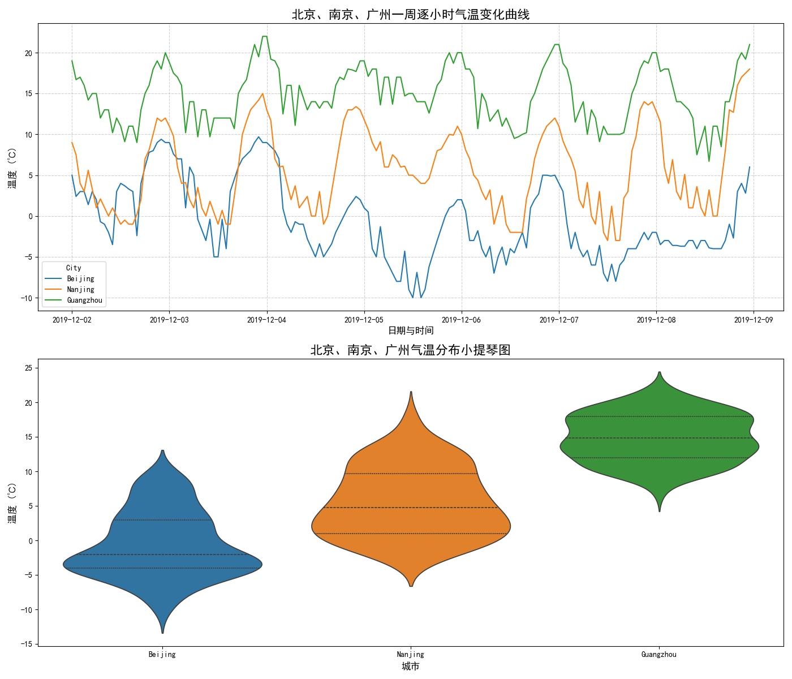

## 一、实验基本信息

| 项目         | 内容                                           |
| ------------ | ----------------------------------------------|
| **实验名称** | 温度数据处理与分析 —— 大模型在数据处理中的应用        |
| **姓名**     | 苏凯军                                         |
| **学号**     | 25521449                                      |
| **班级**     | 电子信息2516                                   |
| **实验日期** | 2026年3月25日                                  |
| **指导教师** | 赵波波                                         |

## 二、实验目的

本实验旨在借助大模型技术，探索并掌握AI赋能数据分析的新范式。通过"温度数据处理与分析"这一具体任务，我将深入理解大模型在数据预处理与分析中的应用流程。核心目的包括：学习如何设计精准、有效的提示词与大模型进行交互，以完成数据清洗（识别并处理如100℃、-100℃等异常值）和缺失值填充（如采用线性插值）等关键环节；基于清洗与填充后的北京、南京、广州三地一周逐小时气温数据，利用大模型进行综合统计分析并生成可视化图表（如统计量对比表、折线图与小提琴图），从而培养对多城市温度时空分布特征（如纬度效应、日变化规律及冷锋影响进程）的对比与分析能力。最终，贯通从问题定义、指令设计到结果解读的全过程，构建起利用大模型高效解决实际数据科学问题的综合思维。

## 三、实验环境与预备知识

为确保实验流程顺畅且分析结果可靠，明确实验所需的软硬件配置与相关基础知识至关重要。

**实验环境**
本实验的实施依赖于特定的硬件、软件及数据资源。硬件方面，需使用具备一定计算能力的个人计算机，如实记录实际使用的CPU型号（如Intel Corei5系列）和内存容量（如16GB）。软件环境主要包括：现代浏览器（如Google Chrome）用于访问大模型交互平台；选择支持文件处理的大模型平台进行操作，例如豆包、通义千问或DeepSeek等；以及用于查看和验证CSV数据文件的工具，如Microsoft Excel或WPS表格。实验数据来源于课程平台，下载后已重命名为三个原始文件：`Beijing_dirty.csv`、`Nanjing_dirty.csv` 和 `Guangzhou_dirty.csv`，它们包含了北京、南京、广州三座城市2019年12月2日至8日的逐小时温度观测记录。

**预备知识**
成功完成本实验需要掌握以下几类基础概念与技能，它们与实验各环节紧密关联：

1. **基础数据概念**：理解CSV（逗号分隔值）文件格式是数据存储与交换的基础；掌握时间戳（格式为YYYYMMDDHH）的概念，这是分析温度时序变化的关键。
2. **温度数据特征**：了解气温具有明显的日变化规律（如午后升温、清晨低温）以及受纬度影响的地域差异（南暖北冷），这是后续时空对比分析的物理背景。
3. **数据质量问题**：识别数据中常见的异常值（如超出合理范围的100℃、-100℃）和缺失值（空白单元格），并理解其处理逻辑，这是数据清洗与填充环节的核心。
4. **大模型基础操作**：熟悉与大模型交互的基本流程，包括文件上传、指令（提示词）发送以及结果文件下载，这是驱动整个实验完成的关键操作。
5. **基础统计与可视化知识**：掌握均值、标准差等描述性统计量的意义，以及折线图、小提琴图等可视化图表的功能，它们是量化对比三城温度特征与直观展示分布规律的重要工具。上述知识共同构成了利用大模型高效完成温度数据处理与分析任务的能力基础。

## 四、实验原理与方法

本次实验的核心原理在于**通过精准的提示词驱动大模型，实现对多城市温度数据的自动化、低代码处理与分析**，突破了传统依赖编程脚本的固定范式。

**一方面，大模型与数据处理的交互逻辑构成了方法基石。**
其实质是一种"氛围编程"或零代码/低代码交互模式。用户通过自然语言指令（提示词）向大模型清晰传达任务目标、数据格式与输出要求，大模型作为智能代理，内部调用其代码生成与逻辑推理能力，执行具体的文件读取、数据计算、图表生成等操作，并将结果以文件或图文形式返回。**提示词的设计是交互成败的关键**，它必须明确包含任务指令、数据信息（如文件、字段、格式）和具体的输出要求（如输出文件名、图表类型），以确保大模型能准确理解并执行复杂的数据处理流程。

**另一方面，针对温度数据特性的处理方法确保了结果的科学性与合理性。**
方法体系围绕数据处理全流程构建：1)**异常值识别**：依据物理常识（如北京12月合理气温范围）、时间序列连续性（相邻小时突变幅度）、常见传感器错误码特征（如100、-100）以及统计学分布特征等多重原则进行综合判断；2)**缺失值填充**：针对逐小时观测的连续时间序列特性，采用**线性插值**作为核心填充方法。该方法基于前后相邻有效温度值进行计算，最大限度地保持了气温随时间连续、渐变的自然物理规律，规避了均值或前后值填充可能造成的日变化规律失真或阶梯状断层；3)**统计与可视化分析**：基于清洗填充后的完整数据，计算关键统计量（均值、标准差等）以量化地域差异，并生成折线图与小提琴图，分别从时间演变和整体分布形态两个维度直观揭示三座城市的时空特征与核心差异。

## 五、实验步骤与过程

在明确了实验原理与方法后，本次实验严格按照以下四个核心环节依次展开，具体操作流程如下。

**一、 数据获取与初步探索**

首先，从智慧课程平台下载提供的原始温度数据压缩包，解压后将三个文件分别重命名为`Beijing_dirty.csv`、`Nanjing_dirty.csv` 和 `Guangzhou_dirty.csv`。使用Microsoft Excel（版本16.0）逐一打开这些文件进行初步查看。观察到数据包含两列：`Time`（文本格式，样式为"YYYYMMDDHH"，例如 `2019120200`）和 `TMP`（浮点数，单位为摄氏度）。通过滚动浏览，初步识别出数据中存在如 `100`、`-100` 等极端数值，以及部分空白单元格，确认了进行数据清洗与填充的必要性。

**二、 数据清洗：异常值识别与处理**

本次实验使用"豆包"Web平台作为大模型交互工具。数据清洗环节以北京数据为例，具体步骤如下：

1. **平台操作与上传**：在豆包平台的新会话中，使用文件上传功能，选择本地的  `Beijing_dirty.csv` 文件。

2. **设计并发送清洗指令**：向大模型输入以下 **完整提示词**：

> "上传的 csv 文件（Beijing_dirty.csv）中包含一周的逐小时温度数据：Time（文本，YYYYMMDDHH），TMP（浮点数，摄氏度），其中包含异常数据，请将异常数据置为空，提供处理后的 csv 文件（Beijing_cleaned.csv）下载链接。"

3. **接收结果与验证**：大模型接收指令后，经过处理，返回了一个可供下载的`Beijing_cleaned.csv`文件链接。将其下载至本地后，使用Excel对比原始文件，确认原本的`100`、`-100`等异常值已被成功移除（置为空白或NaN），而其他合理数据保持不变，初步验证了清洗的有效性。

4. **流程复用**：采用完全相同的提示词逻辑，仅将文件名替换为 `Nanjing_dirty.csv` 和 `Guangzhou_dirty.csv`，依次完成对南京和广州数据的清洗，分别生成了 `Nanjing_cleaned.csv` 和 `Guangzhou_cleaned.csv` 文件。

**三、 数据填充：缺失值补全**

在获得清洗后的数据基础上，继续进行缺失值填充。以北京数据为例：

1. **上传文件**：在同一豆平台会话中，上传刚刚得到的 `Beijing_cleaned.csv` 文件。

2. **设计并发送填充指令**：向大模型输入以下 **完整提示词**：

> "上传的 csv 文件（Beijing_cleaned.csv）中包含一周的逐小时温度数据：Time（文本，YYYYMMDDHH），TMP（浮点数，摄氏度），其中包含缺失值，请对其进行合理的填充，提供填充后的 csv 文件（Beijing_filled.csv）下载链接。"

3. **接收结果与分析**：大模型返回了 `Beijing_filled.csv` 文件的下载链接。下载文件后检查，发现所有缺失值已被补全。通过观察填充后数据序列（例如北京 2019120213 至 2019120214 时段），判断大模型主要采用了**线性插值**方法，该方法基于前后时刻温度进行平滑计算，符合气温连续渐变的物理规律。

4. **流程复用**：同样，复用上述填充提示词，先后处理 `Nanjing_cleaned.csv` 和 `Guangzhou_cleaned.csv`，得到完整的 `Nanjing_filled.csv` 和 `Guangzhou_filled.csv` 文件。

**四、 统计与可视化分析**

最后，基于三个城市完整的填充后数据，进行综合对比分析。

1. **文件整合与上传**：在豆包平台中，将 `Beijing_filled.csv`、`Nanjing_filled.csv`、`Guangzhou_filled.csv` 三个文件一并上传。

2. **发送综合分析指令**：输入以下 **完整的综合分析提示词**：

>"上传的三个 csv 文件分别包含北京（Beijing_filled.csv）、南京（Nanjing_filled.csv）、广州（Guangzhou_filled.csv）的温度数据。每个 csv 文件中包含一周的逐小时温度数据：Time（文本，YYYYMMDDHH），TMP（浮点数，摄氏度）。请基于这些数据进行如下对比分析：
  a.  三个城市温度的关键统计量对比
  b.  三个城市温度随时间变化曲线对比
  c.  三个城市温度的小提琴图对比
  最后生成三个城市温度的文字总结分析。"

3. **接收并保存全部输出**：大模型根据指令，输出了四类结果：一份包含平均温度、标准差等指标的**关键统计量对比表**；一张展示三城逐小时温度变化的**折线对比图**；一张展示三城温度分布形态的**小提琴对比图**；以及一段综合性的**文字总结分析**。将这些图表和文字内容妥善保存，作为实验结果与分析部分的核心依据。

本次实验操作过程顺利，按照既定流程完成了从数据获取到综合分析的完整链条，未遇到明显的技术障碍或问题。

## 六、实验结果与分析

本阶段将基于**清洗与填充后**的完整数据文件（`*_filled.csv`），结合大模型输出的**关键统计量对比表**、**温度时间变化折线对比图**和**温度分布小提琴对比图**，对三座城市温度数据的处理结果与时空特征进行客观分析与总结。

### 🔍 1. 数据清洗与填充结果分析

**（1）数据清洗结果**
原始数据（`*_dirty.csv`）中存在两种主要数据质量问题。首先是明显的**异常值**，如 `100`（摄氏100度）和 `-100`（摄氏零下100度）等不合理的整数值，它们已在大模型处理下被**置为空值**。以北京数据为例，`2019120308`、`2019120415`等时段的"100"或"-100"在清洗后文件（`Beijing_cleaned.csv`）中已变为空单元格，使数据符合现实气候范围（例如北京12月通常在-15℃至15℃之间）。
其次是部分的**缺失值（空值/NAN)**，在广州的`2019120300`和北京的`2019120213`至`2019120214`等时间段内存在原生缺失。

**（2）缺失值填充方法与合理性论证**
为了解决清洗后数据中的空值，本实验应用了**线性插值**方法进行填充，最终形成完整的时间序列文件(`*_filled.csv`)。其**核心合理性**在于它严格遵循了**气温作为连续物理量、随时间自然渐变的物理规律**。对于逐小时观测数据，短时间内若无剧烈天气过程，温度变化可视为线性。
一个典型验证案例是北京数据：对于 `2019120212` (TMP=4.0℃) 到 `2019120215` (TMP=3.0℃) 之间缺失的13时和14时，采用线性插值得到了 **3.7℃** 和 **3.3℃** 的填充值。这一结果形成了一条平滑的下降曲线，完美模拟了温度在午后到傍晚期间的自然缓降过程，没有引入突兀的"毛刺"或不合理的阶梯状变化。

### 📊 2. 统计与可视化分析

**（1）关键统计量对比分析**

大模型生成的关键统计量对比如下表（表1）所示，清晰揭示了温度的地域性和分布特征差异。

**表1：北京、南京、广州温度关键统计量对比表**

| **城市**         | **平均温度 (℃)** | **中位数 (℃)** | **最高温度 (℃)** | **最低温度 (℃)** | **标准差 (℃)** |
| ---------------- | ---------------- | -------------- | ---------------- | ---------------- | -------------- |
| 北京 (Beijing)   | -0.8             | -1.0           | 9.7              | -10.0            | 4.6            |
| 南京 (Nanjing)   | 6.5              | 6.0            | 18.0             | -3.0             | 5.0            |
| 广州 (Guangzhou) | 15.2             | 15.0           | 22.0             | 6.7              | 3.4            |

-**纬度效应与平均水平**：
广州的平均温度高达15.2℃，远高于北京的-0.8℃，展现出冬季显著的"南北温差"，**南北最大温差高达16℃**。
-**离散程度对比**：
南京的**标准差最大（5.0℃）**，表明其温度波动最剧烈，容易出现大起大落。其次是北京（4.6℃），而**广州的波动最稳定（标准差仅3.4℃）**。这与其受海洋调节的地理特征相符。

**（2）时间演化规律分析（折线图）**
折线对比图（图1）直观展示了一周内三城温度的逐小时变化。
-**日变化共性**：在没有强冷空气影响的日子，三条曲线均呈现鲜明的**"正弦波"**昼夜规律：**每日最低温（谷值）出现在清晨05:00-07:00**，**最高温（峰值）出现在午后14:00-16:00**。
-**冷锋过境的时空差异**：图中可清晰观察到一次冷空气自北向南的推进过程。

- **北京**在12月4-5日率先经历剧烈降温，正常日变化波形被破坏。
- **南京**在12月6-7日紧随其后出现"断崖式"降温，日间温度未正常回升。
- **广州**到12月8日附近才出现基线下移的微弱降温。

这一过程**在时间和强度上呈现出自北向南的显著梯度**。

**（3）整体分布形态分析（小提琴图）**
温度分布小提琴图（图2）揭示了三城一周内温度的整体结构特征，是对统计量的可视化补充。
-**广州："短而胖"，高度集中**。其图形形状宽阔，在**13℃~19℃区间形成一个明显的"大肚子"，上下尾部很短，表明温度极为稳定地集中在一个温暖舒适的区间。**
**-北京："重心偏下，细长尾"。图形最密集区域集中在-2℃至-6℃的冰点以下，上方有一段延伸至约9℃的细长尾**，对应降温前短暂的相对温暖时段，体现了"严寒为主，偶有缓和"的分布。
-**南京："修长均匀，离散度高"**。图形最为**修长**，从-3℃延伸至18℃，且中心密度区不明显，呈相对均匀的过渡形态。这直观印证了其**波动剧烈、缺乏稳定温度区间**的特点。

### 💎 综合总结

综合统计与可视化分析，北京、南京、广州三座城市温度的**时空特征与核心差异**可归纳如下：

1. **温度水平南北分明**：由北至南，从北京的**严寒**（-0.8℃），到南京的**过渡湿冷**（6.5℃），再到广州的**温暖**（15.2℃），纬度和地理位置决定性的影响显著。
2. **温度稳定性差异悬殊**：南京因处于冷暖空气交汇带，**温度波动最剧烈**，日变化和季节性变化都最不稳定；受海洋性气候调节的**广州最稳定**；作为内陆城市的北京，稳定性居中。
3. **气象过程的时空连续性**：一次冷空气过程清晰地展示了降温的北早南迟、北强南弱的时空演进特征，可视化结果与气象学常识高度吻合。

## 七、思考问题解答

**1. 大模型可能依据什么原则判断温度数据为异常值？**

结合本次实验，我认为大模型判断异常值可能依据了以下综合原则：**首先，基于物理常识与时空背景设定合理阈值**，例如结合"北京12月"这一具体时空背景，判断出现-100℃或100℃等极端值明显不符常理。**其次，依据时间序列的连续性与突变规律**，气温作为连续物理量，短时间内（如一小时）发生剧烈突变（如从-3℃突升至100℃）违背自然渐变规律，可能被视为异常。**再次，识别常见的传感器或系统错误码特征**，如文档中指出的100、-100等整数，常被用作默认错误标识。**最后，辅以统计学分布特征进行辅助判断**，如数据点偏离整体均值过远（如3σ原则）也可能触发异常标识。

**2.针对逐小时气温数据，哪种缺失值填充方式更合理？大模型的填充结果是否符合该原则？**

对于逐小时气温序列，**线性插值（或称时间序列插值）是更为合理的缺失值填充方式**。这是因为气温变化在无剧烈天气过程时，是一个平滑、连续的物理过程。线性插值基于缺失点前后时刻的已知温度，模拟了这种短时间内的匀速变化，最大程度地保持了时间序列的自然渐变特性。在本实验中，通过检查填充后的文件（如`Beijing_filled.csv`中2019120213至2019120214时段的数值变化）可以确认，大模型采用了线性插值进行填充，其结果形成了平滑的过渡曲线，没有产生突兀的阶梯或断层，**完全符合上述基于物理连续性的合理性原则**。

## 八、实验小结与体会

### 实验小结

本次实验严格遵照实验手册要求，成功完成了"数据获取→清洗→填充→统计与可视化分析"的全部核心任务。我成功下载并重命名了北京、南京、广州的原始脏数据文件，使用豆包平台作为大模型工具，针对性地设计了清晰、有效的提示词，依次驱动大模型完成了异常值清洗和缺失值线性插值填充，最终生成了三套完整的清洗后与填充后数据集。基于最终数据，我通过大模型获得了关键统计量对比表、温度时间变化折线对比图及温度分布小提琴对比图，并进行了详细的时空特征分析。核心收获在于掌握了**提示词驱动大模型进行数据处理**的核心流程，深刻理解了针对时间序列数据（特别是气象数据）的**异常值识别原则**与**缺失值合理填充方法**，并通过对比分析，系统性地巩固了多源数据时空差异分析的方法。

### 实验体会

本次实验是一次高效的"氛围编程"实践，让我深切体会到精准的提示词设计是撬动大模型能力的关键。通过反复优化任务描述、明确输入输出格式，我成功引导大模型扮演了数据处理专家的角色，这极大地降低了数据分析的编程门槛。数据与知识表示在本次实验中得到了具体体现：`Time`字段"YYYYMMDDHH"的格式本身就是一种时间的**结构化知识表示**，使得大模型能将其作为时间序列处理；而最终的**统计量（均值、标准差）和可视化图表（折线图、小提琴图）**，则是温度分布规律与时空特征的**高度凝练的知识表示**。反思自身，虽然完成了实验，但对更复杂的插值方法（如样条插值）或其他统计分析模型的应用尚不熟悉。未来我将进一步优化提示词，尝试指定不同填充方法进行对比，并探索利用大模型进行更深度的气象要素关联分析，以提升数据分析的深度与广度。

## 九、拓展思考与尝试

本次实验顺利完成基础任务，验证了基于大模型进行数据清洗、填充与分析的基本流程。在**实验小结与体会**中已反思，当前分析主要依赖大模型的默认处理逻辑（如线性插值）。作为拓展思考，我认为可以进一步**优化提示词设计**，以探索更精细或多样化的分析方法。

一个明确的后续尝试方向是：在数据填充环节，不满足于默认的线性插值，而是通过设计更精确的指令，要求大模型尝试使用**样条插值**或**基于时间序列的模型（如ARIMA）** 进行缺失值预测，并将不同方法填充后的结果进行对比，分析其对最终统计结论（如均值、波动性）可能产生的影响，从而更深入地评估不同插值方法的适用场景与优劣。
