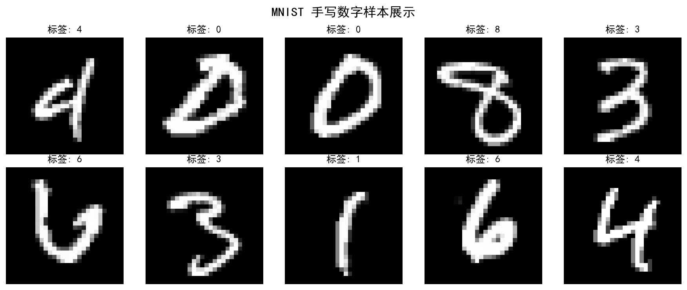
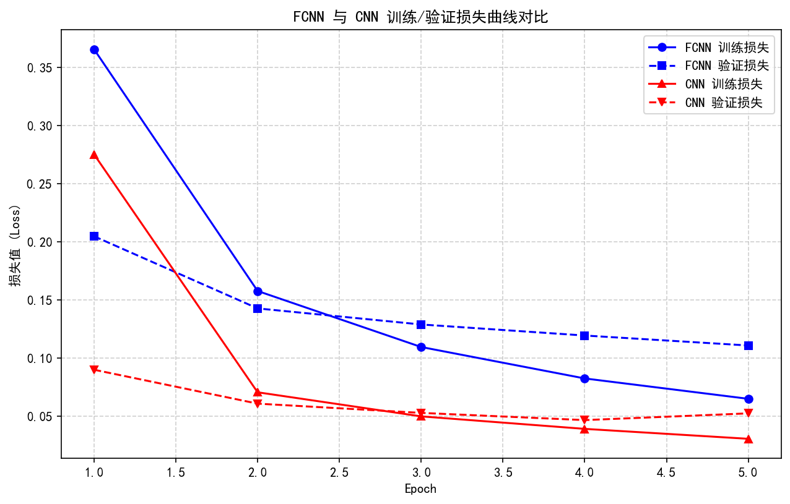
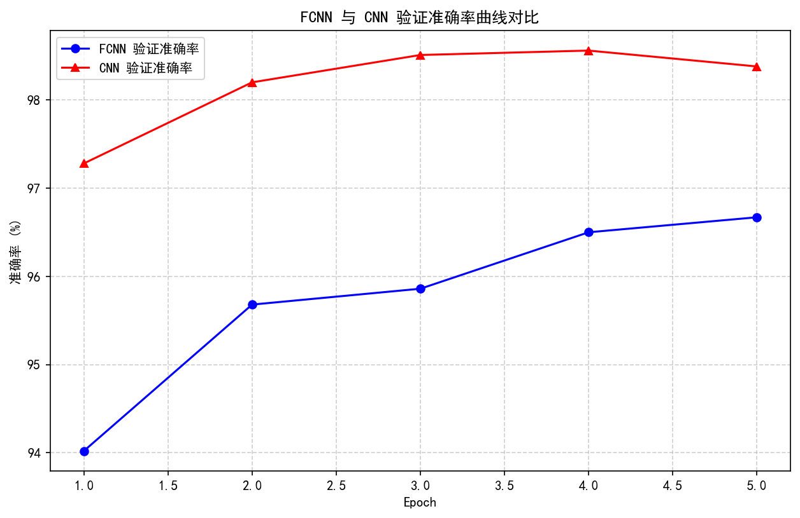
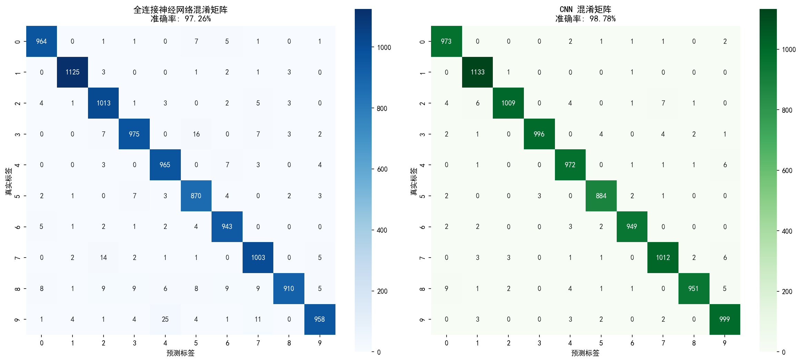
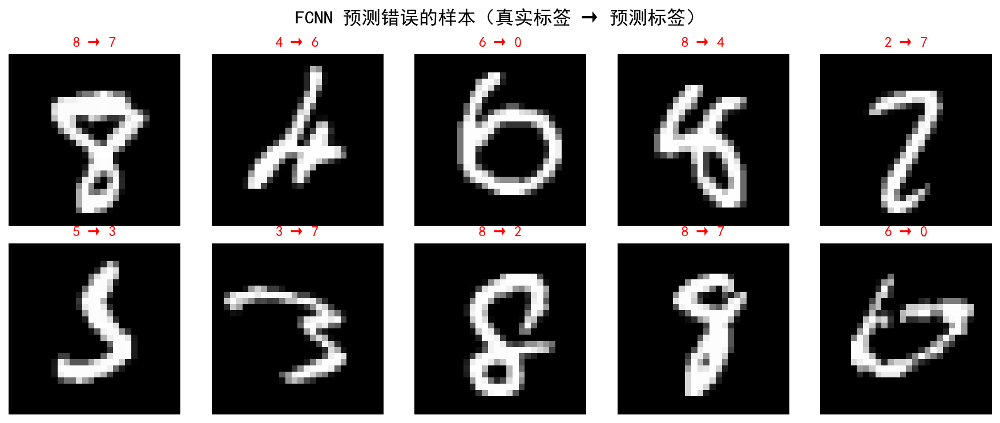

# 实验三：基于神经网络的手写数字识别实验

**姓名**：苏凯军  
**学号**：25521449  
**班级**：电子信息2516  
**实验日期**：2026年5月20日  
**指导教师**：赵波波

---

## 一、实验目的

1. 了解深度学习在图像分类任务中的基本应用方式，掌握利用神经网络完成手写数字识别的完整流程。
2. 理解全连接神经网络与卷积神经网络在输入表示、模型结构和特征提取方式上的差异。
3. 掌握图像数据预处理的基本方法，包括张量转换、归一化、批量加载和标签编码。
4. 掌握神经网络实验的基本步骤，包括数据读取、模型定义、损失函数设置、优化器设置、训练、测试和结果评估。
5. 学会使用准确率、损失曲线、混淆矩阵和错误样本可视化分析模型效果。
6. 学会借助大模型辅助完成代码生成、调试、结果解释和实验报告撰写。

---

## 二、实验环境

- **操作系统**：Windows 11
- **Python 版本**：3.12（Anaconda d2l 环境）
- **开发工具**：VS Code
- **主要依赖库**：
  - `torch` 2.10.0+cu130
  - `torchvision` 0.25.0+cu130
  - `numpy`
  - `matplotlib` 3.10.8
  - `scikit-learn` 1.7.2
  - `seaborn`
- **硬件环境**：CPU（Intel i5），内存 16GB
- **运行设备**：CPU（本次实验在 CPU 环境下完成）

---

## 三、数据集介绍

本实验使用 **MNIST 手写数字数据集**，这是深度学习领域最经典的数据集之一，广泛用于图像分类算法的入门学习和基准测试。

### 数据集基本信息

| 数据项 | 含义 | 说明 |
|--------|------|------|
| 图像大小 | 28 × 28 像素 | 灰度图像，单通道 |
| 类别数量 | 10 类 | 数字 0~9 |
| 训练集 | 60,000 张 | 用于模型参数学习 |
| 测试集 | 10,000 张 | 用于评估模型泛化能力 |
| 像素值范围 | 0 ~ 1 | 经过归一化处理 |

### 数据集分布

MNIST 数据集中各类别数量较为均衡，每类数字约有 5900~6700 张图片，适合直接用于分类模型训练，无需额外的类别平衡处理。

### 数据预处理

1. **张量转换**：使用 `transforms.ToTensor()` 将 PIL Image 转换为 PyTorch 张量，并自动将像素值从 [0, 255] 归一化到 [0, 1]。
2. **训练/验证划分**：将 60,000 张训练图片划分为 50,000 张训练 + 10,000 张验证，用于监控训练过程中的模型表现。
3. **批量加载**：使用 `DataLoader` 按批次（batch_size=64）加载数据，训练时打乱顺序（shuffle=True），测试时保持顺序（shuffle=False）。

---

## 四、模型结构

### 4.1 全连接神经网络（FCNN）

全连接神经网络将 28×28 的图像展平为 784 维向量作为输入，通过多层全连接层学习像素之间的组合特征。

| 层次 | 结构 | 作用说明 |
|------|------|----------|
| 输入层 | Flatten: 1×28×28 → 784 | 将二维图像展平为一维向量 |
| 隐藏层 1 | Linear(784, 128) + ReLU | 学习像素之间的组合特征 |
| 隐藏层 2 | Linear(128, 64) + ReLU | 进一步组合特征 |
| 输出层 | Linear(64, 10) | 输出 10 类数字的得分 |
| 损失函数 | CrossEntropyLoss | 用于多分类任务 |
| 优化器 | Adam (lr=0.001) | 自适应学习率优化 |

**模型参数量**：109,386

### 4.2 卷积神经网络（CNN）

卷积神经网络保留了图像的二维空间结构，通过卷积层和池化层提取局部空间特征，再通过全连接层完成分类。

| 层次 | 结构 | 作用说明 |
|------|------|----------|
| 输入层 | 1×28×28 | 灰度图像输入 |
| 卷积层 1 | Conv2d(1, 16, 3, padding=1) + ReLU | 提取低层局部特征 |
| 池化层 1 | MaxPool2d(2) | 降低特征图尺寸（28→14） |
| 卷积层 2 | Conv2d(16, 32, 3, padding=1) + ReLU | 提取更丰富的图像特征 |
| 池化层 2 | MaxPool2d(2) | 进一步压缩特征图（14→7） |
| 展平层 | Flatten | 将 32×7×7 特征图展平为 1568 维 |
| 全连接层 | Linear(1568, 128) + ReLU | 组合卷积提取到的特征 |
| 输出层 | Linear(128, 10) | 输出 10 类数字得分 |
| 损失函数 | CrossEntropyLoss | 用于多分类任务 |
| 优化器 | Adam (lr=0.001) | 自适应学习率优化 |

**模型参数量**：206,922

---

## 五、实验过程

### 5.1 数据加载与探索（任务零）

1. 使用 `torchvision.datasets.MNIST` 自动下载并加载数据集。
2. 查看训练集（60,000 张）和测试集（10,000 张）的样本数量。
3. 随机显示若干张手写数字图片，观察图片内容和标签。
4. 查看单张图片的张量形状为 `torch.Size([1, 28, 28])`，即 1 通道、28×28 像素。
5. 统计训练集中各数字类别数量，确认数据集均衡性。

### 5.2 全连接神经网络建模（任务一）

1. 定义 FCNN 模型类，包含展平层、两个隐藏层和一个输出层。
2. 设置损失函数 `CrossEntropyLoss` 和优化器 `Adam`。
3. 训练 5 个 epoch，每轮记录训练损失、验证损失和验证准确率。
4. 在测试集上评估模型性能，计算分类准确率和混淆矩阵。
5. 绘制训练损失曲线、验证准确率曲线和混淆矩阵。
6. 随机显示 10 张测试图片，标注真实标签和预测标签。

### 5.3 卷积神经网络建模（任务二）

1. 定义 CNN 模型类，包含两层卷积+池化和两层全连接。
2. 同样使用 `CrossEntropyLoss` 和 `Adam` 优化器。
3. 训练 5 个 epoch，记录训练指标。
4. 在测试集上评估模型性能。
5. 绘制损失曲线、准确率曲线和混淆矩阵。
6. 展示预测正确和预测错误的样本图片。

### 5.4 模型比较与结果分析（任务三）

1. 对比 FCNN 和 CNN 的训练损失曲线和验证准确率曲线。
2. 并列绘制两个模型的混淆矩阵。
3. 统计各数字类别的预测错误数，找出最容易混淆的数字对。
4. 分析预测错误样本，尝试解释错误原因。
5. 从输入表示、特征提取、参数数量、训练效果和可解释性角度比较两种模型。

---

## 六、实验结果

### 6.1 模型训练结果对比

| 指标 | 全连接神经网络 (FCNN) | 卷积神经网络 (CNN) |
|------|----------------------|-------------------|
| 训练轮数 | 5 epoch | 5 epoch |
| 训练时间 | 77.58 秒 | 131.11 秒 |
| 模型参数量 | 109,386 | 206,922 |
| **测试集准确率** | **97.26%** | **98.78%** |
| 测试集正确数 | 9,726 | 9,878 |
| 测试集错误数 | 274 | 122 |

### 6.2 训练损失曲线对比

从图中可以看出：
- **CNN 收敛更快**：在第 1 个 epoch 时，CNN 的验证损失就已经明显低于 FCNN。
- **CNN 损失更低**：训练结束时，CNN 的验证损失约为 0.05，而 FCNN 约为 0.11。
- **两者均无严重过拟合**：训练损失和验证损失走势基本一致，没有出现训练损失持续下降而验证损失上升的情况。

### 6.3 验证准确率曲线对比

从图中可以看出：
- **CNN 准确率始终高于 FCNN**：从第 1 个 epoch 开始，CNN 的验证准确率就领先 FCNN。
- **CNN 最终准确率达到 98.38%**（验证集），FCNN 为 96.67%。
- **两者都在持续提升**：5 个 epoch 内，两个模型的准确率都还有上升空间。

### 6.4 混淆矩阵对比

**FCNN 混淆矩阵分析**：
- 对角线数值较高，说明大部分数字都能正确分类。
- 最容易混淆的组合：**9→4**（25 次）、**3→5**（16 次）、**7→2**（14 次）。
- 数字 8 的错误率相对较高，容易被误判为 2 或 3。

**CNN 混淆矩阵分析**：
- 对角线数值更高，整体分类效果更好。
- 错误数量大幅减少，仅 122 个样本预测错误。
- 最容易混淆的组合：**8→0**（9 次）、**2→7**（7 次）、**2→1**（6 次）。

### 6.5 各数字类别错误数统计

| 数字 | FCNN 错误数 | CNN 错误数 |
|------|------------|-----------|
| 0 | 16 | 7 |
| 1 | 10 | 2 |
| 2 | 19 | 23 |
| 3 | 35 | 14 |
| 4 | 17 | 10 |
| 5 | 22 | 8 |
| 6 | 15 | 9 |
| 7 | 25 | 16 |
| 8 | 64 | 23 |
| 9 | 51 | 10 |

**观察**：
- CNN 在几乎所有数字上的错误数都少于 FCNN。
- FCNN 对数字 **8** 和 **9** 的分类效果最差（分别错误 64 次和 51 次）。
- CNN 对数字 **8** 的识别仍有挑战（23 次错误），但相比 FCNN 已有显著改善。

### 6.6 预测错误样本分析

上图展示了 FCNN 预测错误的部分样本。可以看出，这些样本本身具有一定的模糊性或书写不规范，例如：
- 数字 9 被预测为 4：可能是因为上半部分的圆弧不够闭合。
- 数字 7 被预测为 2：可能是因为横线不够明显，整体形状接近 2。
- 数字 8 被预测为 3：可能是因为上半部分和下半部分的连接不够清晰。

---

## 七、结果分析

### 7.1 两种模型的核心差异

| 比较维度 | 全连接神经网络 (FCNN) | 卷积神经网络 (CNN) |
|----------|----------------------|-------------------|
| 输入表示 | 展平为 784 维向量，丢失空间信息 | 保留 1×28×28 图像张量结构 |
| 特征提取 | 全连接层学习全局组合特征 | 卷积层提取局部空间特征 |
| 参数量 | 109,386 | 206,922 |
| 训练时间 | 77.58 秒 | 131.11 秒 |
| 测试准确率 | 97.26% | 98.78% |
| 可解释性 | 特征含义不明确 | 卷积核可可视化，特征可解释 |

### 7.2 CNN 优于 FCNN 的原因

1. **保留空间结构**：CNN 通过卷积核在图像上滑动，能够捕捉局部的边缘、纹理等特征，而 FCNN 展平后丢失了像素之间的空间关系。

2. **参数共享**：卷积核在整个图像上共享参数，减少了模型参数量（虽然本实验中 CNN 参数量更多，但主要在全连接层；卷积部分参数高效利用）。

3. **局部特征提取**：池化层降低了特征图尺寸，同时保留了主要信息，使得模型对平移、缩放等变化具有一定的不变性。

4. **层次化特征学习**：第一层卷积学习简单的边缘和线条，第二层卷积学习更复杂的形状和模式，这种层次化特征表示更适合图像分类任务。

### 7.3 容易混淆的数字分析

1. **8 和 3**：两者都有上下两个圆弧，书写不规范时容易混淆。
2. **9 和 4**：9 的上半部分和 4 的封闭区域有一定相似性。
3. **7 和 2**：7 带有横线时可能与 2 的形状接近。
4. **2 和 1**：2 写得较直时可能与 1 混淆。

CNN 通过局部特征提取，能够更好地分辨这些细微差异，因此在这类易混淆数字上的表现优于 FCNN。

---

## 八、思考问题

### 任务零思考问题

**1）MNIST 数据集是否存储在了你的电脑上？MNIST 数据集中的图像为什么不能在本地直接查看？MNIST 数据集的标签和图像是如何对应的？**

答：是的，MNIST 数据集在首次运行代码时通过 `torchvision.datasets.MNIST` 自动下载到了本地 `./data/MNIST` 目录下。MNIST 数据集原始格式是二进制文件（不是常见的图片格式如 PNG 或 JPG），因此不能直接双击查看。需要通过 Python 代码将其解码并转换为图像格式才能查看。数据集中的每个样本由一张 28×28 的像素矩阵和一个 0~9 的整数标签组成，两者按索引一一对应，即第 i 张图片对应第 i 个标签。

**2）刚才的任务中，你是否对 MNIST 数据进行了预处理？这些操作对神经网络训练有什么作用？**

答：进行了以下预处理：
- **张量转换**：使用 `transforms.ToTensor()` 将图像从 PIL Image 转换为 PyTorch 张量，并将像素值从 [0, 255] 归一化到 [0, 1]。
- **批量加载**：使用 `DataLoader` 将数据分成小批量（batch_size=64）送入模型。

这些预处理的作用：
- 归一化使输入数据的尺度统一，有助于梯度稳定下降，加速模型收敛。
- 批量训练提高了计算效率，同时使梯度估计更加稳定。

### 任务一思考问题

**1）为什么全连接网络需要展平层？它作用是什么？**

答：全连接层的输入必须是一维向量。图像数据通常是二维（28×28）或三维（通道×高×宽）的张量，无法直接输入到 `Linear` 层中。展平层（`Flatten`）的作用就是将多维张量按行或按列依次展开为一维向量，例如将 1×28×28 的图像展平为 784 维的向量，使其能够与全连接层的神经元进行矩阵乘法运算。

**2）全连接神经网络的深度和宽度如何选择？一定是越大越好吗？为什么？**

答：深度（层数）和宽度（每层神经元数）的选择需要在模型表达能力和计算资源之间权衡：
- **深度**：增加层数可以提高模型的非线性表达能力，能够学习更复杂的特征组合，但过深会导致梯度消失/爆炸问题，训练困难。
- **宽度**：增加神经元数可以提高单层的学习能力，但过宽会导致参数量剧增，容易过拟合，且计算成本上升。

不是越大越好。过深的网络会导致梯度消失，难以训练；过宽的网络会导致过拟合，泛化能力下降。实际中需要根据任务复杂度、数据量和计算资源合理选择。本实验中两层隐藏层（128→64）已经能够取得较好的效果。

**3）训练准确率较高但测试准确率较低，可能说明什么问题？**

答：这说明模型出现了**过拟合（Overfitting）**。模型过度学习了训练数据中的噪声和特例，导致在训练集上表现很好，但在未见过的新数据（测试集）上表现差。解决方法包括：增加数据量、使用 Dropout 正则化、提前停止（Early Stopping）、数据增强、减小模型复杂度等。

**4）哪些数字之间更容易被全连接神经网络模型混淆？可能原因是什么？**

答：从混淆矩阵分析，FCNN 最容易混淆的数字对包括：**9→4**（25 次）、**3→5**（16 次）、**7→2**（14 次）。原因是：
- FCNN 将图像展平后丢失了空间结构信息，只能依赖像素的全局组合进行判断。
- 某些数字在像素分布上确实存在相似性（如 9 和 4 的上半部分、3 和 5 的下半部分）。
- 当书写不够规范时，这种基于全局像素统计的方法难以分辨局部细节差异。

### 任务二思考问题

**1）卷积层与全连接层最大的区别是什么？**

答：最大的区别在于**局部连接和权值共享**：
- **全连接层**：每个输入节点与所有输出节点相连，参数量大，不考虑输入数据的空间结构。
- **卷积层**：每个卷积核只连接输入的局部区域（感受野），同一个卷积核在整个图像上共享权重。这种设计大大减少了参数量，同时能够提取图像的局部特征（如边缘、纹理），保留了空间信息。

**2）CNN 网络结构（卷积核个数、卷积层数量或池化方式）对模型效果有何影响？**

答：
- **卷积核个数**：更多的卷积核可以提取更多种类的特征，但会增加计算量和参数量。
- **卷积层数量**：更多的卷积层可以学习更抽象、更高层次的特征，但过深会导致梯度消失。
- **池化方式**：最大池化（MaxPool）保留最强响应特征，对平移有一定不变性；平均池化（AvgPool）保留背景信息。不同的池化方式会影响特征的保留程度。

**3）哪些数字之间更容易被 CNN 模型混淆？可能原因是什么？**

答：CNN 最容易混淆的数字对包括：**8→0**（9 次）、**2→7**（7 次）、**2→1**（6 次）。虽然 CNN 整体准确率更高，但仍有一些困难样本：
- **8 和 0**：两者都有闭合的环形结构，书写不规范时 8 的两个环可能融合成一个类似 0 的形状。
- **2 和 7**：2 的底部横线和 7 的横线有一定相似性。
- 这些混淆说明即使 CNN 能提取局部特征，但对于书写极度不规范或形状高度相似的样本，仍存在识别困难。

### 任务三思考问题

**1）两种模型中哪一种测试准确率更高？原因可能是什么？**

答：**CNN 的测试准确率更高（98.78% vs 97.26%）**。原因：
- CNN 通过卷积层保留了图像的空间结构，能够提取局部的边缘、纹理等特征。
- 卷积核的参数共享机制使得模型能够更高效地学习平移不变的特征。
- 层次化的特征提取（低层边缘→中层形状→高层模式）更适合图像分类任务。
- FCNN 展平后丢失了像素之间的空间关系，只能依赖全局像素统计，难以捕捉局部细节。

**2）如果增加训练轮数，模型效果一定会持续提升吗？为什么？**

答：**不一定**。在训练初期，增加轮数通常会提升模型效果（欠拟合阶段）。但当训练轮数过多时，模型可能开始过拟合训练数据，导致验证准确率和测试准确率不再提升甚至下降。此外，如果学习率设置不当，过多的训练轮数可能导致模型在最优解附近震荡而无法收敛。因此，实际训练中通常采用验证集监控，当验证指标不再提升时提前停止训练（Early Stopping）。

**3）使用大模型解释实验结果时，哪些结论需要自己再检查和验证？**

答：需要自行验证的结论包括：
- **准确率数值**：必须自己运行代码得到实际结果，不能直接使用大模型给出的示例数值。
- **混淆矩阵分析**：哪些数字容易混淆需要通过自己的实验结果确认，不同模型和随机种子结果可能不同。
- **可视化图表**：损失曲线、准确率曲线的走势需要基于自己的训练日志绘制。
- **错误样本分析**：展示的具体错误样本需要从自己的测试集中随机抽取，不能虚构。
- **原因解释**：大模型给出的一般性解释（如"CNN 更好是因为提取局部特征"）是正确的，但需要结合自己的实验数据加以佐证。

---

## 九、大模型使用说明

在本次实验中，大模型主要在以下环节提供了帮助：

### 9.1 关键提示词

1. **实验任务理解提示词**：
   > "我正在完成一个深度学习实验，数据集是 MNIST 手写数字数据集。请解释手写数字识别任务的问题类型、MNIST 数据集的基本特点，以及使用 PyTorch 加载数据集的完整代码。"

2. **模型构建提示词**：
   > "请帮我设计一个全连接神经网络和一个卷积神经网络，用于 MNIST 手写数字分类。要求包含详细的中文注释，适合大一学生理解。网络结构参考：FCNN 使用 Flatten→Linear(784,128)→ReLU→Linear(128,64)→ReLU→Linear(64,10)；CNN 使用两层 Conv2d+ReLU+MaxPool2d，然后 Flatten→Linear→ReLU→Linear(10)。"

3. **训练与评估提示词**：
   > "请帮我编写 PyTorch 的训练循环代码，包括训练阶段和验证阶段，记录损失和准确率，并绘制损失曲线和准确率曲线。同时需要生成混淆矩阵和分类报告。"

### 9.2 大模型提供的帮助

- **代码框架生成**：提供了 FCNN 和 CNN 的 PyTorch 实现框架。
- **中文注释**：为关键代码步骤添加了适合初学者理解的中文注释。
- **可视化建议**：建议了需要绘制的图表类型（损失曲线、准确率曲线、混淆矩阵、错误样本展示）。
- **结果解释模板**：提供了实验报告中结果分析部分的写作思路和框架。

### 9.3 自己的修改和判断

- **参数调整**：根据实验手册要求，将 batch_size 调整为 64，epoch 设置为 5，学习率使用 Adam 默认的 0.001。
- **代码整合**：将零散的代码片段整合为一个完整的、可一键运行的 Python 脚本。
- **结果验证**：所有图表和数值均通过实际运行代码获得，未直接使用大模型生成的示例数据。
- **错误样本分析**：从自己的测试集中随机抽取错误样本进行分析，而非使用大模型提供的通用案例。
- **思考回答**：结合实验结果和自己的理解，独立完成了所有思考问题的回答。

---

## 十、实验总结

### 10.1 实验收获

1. **理解了深度学习的完整流程**：从数据加载、预处理、模型定义、训练、测试到可视化评估，掌握了使用 PyTorch 进行图像分类的标准流程。

2. **深刻理解了 CNN 的优势**：通过实际对比 FCNN 和 CNN，亲身体验了卷积神经网络在图像分类任务上的显著优势（准确率提升 1.52%），理解了局部特征提取和空间结构保留的重要性。

3. **学会了模型评估方法**：掌握了使用准确率、损失曲线、混淆矩阵和错误样本分析等多种手段综合评估模型效果。

4. **提高了大模型辅助学习能力**：学会了如何设计有效的提示词，利用大模型辅助代码生成和结果解释，同时保持独立思考和验证。

### 10.2 遇到的问题

1. **中文乱码问题**：matplotlib 默认不支持中文，需要通过 `plt.rcParams['font.sans-serif'] = ['SimHei']` 和 `plt.rcParams['axes.unicode_minus'] = False` 解决。

2. **训练时间较长**：在 CPU 环境下训练 5 个 epoch 耗时约 3.5 分钟（FCNN 约 78 秒，CNN 约 131 秒），如果增加轮数或模型复杂度，训练时间会进一步增加。

3. **数据下载问题**：首次运行时需要从网络下载 MNIST 数据集，如果网络不稳定可能导致下载失败。

### 10.3 后续改进方向

1. **增加训练轮数**：5 个 epoch 可能不足以让模型充分收敛，可以尝试 10~20 个 epoch，配合 Early Stopping 防止过拟合。

2. **尝试不同的优化器和学习率**：可以尝试 SGD + Momentum 优化器，或使用学习率衰减策略（如 StepLR、ReduceLROnPlateau）。

3. **添加正则化技术**：尝试 Dropout、Batch Normalization 或数据增强（如随机旋转、平移），进一步提高模型泛化能力。

4. **使用 GPU 加速**：如果有 GPU 环境，可以将模型和数据移动到 GPU 上，大幅缩短训练时间。

5. **尝试更深的 CNN 结构**：可以参考 LeNet、VGG 等经典网络，增加卷积层深度，观察模型效果变化。

6. **手写数字预测**：尝试使用自己手写的数字图片进行预测，检验模型的实际应用效果。

---

## 附录：代码文件

- **实验代码**：`实验三/test.py`
- **结果图片目录**：`实验三/data/`

---

**实验完成时间**：2026年5月20日
