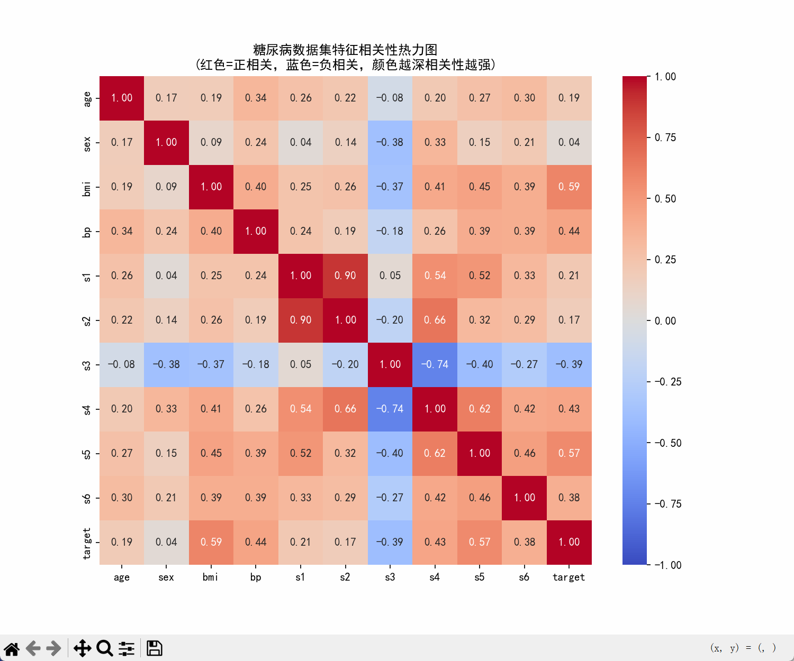
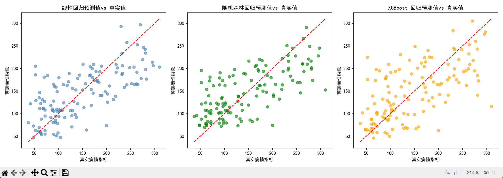
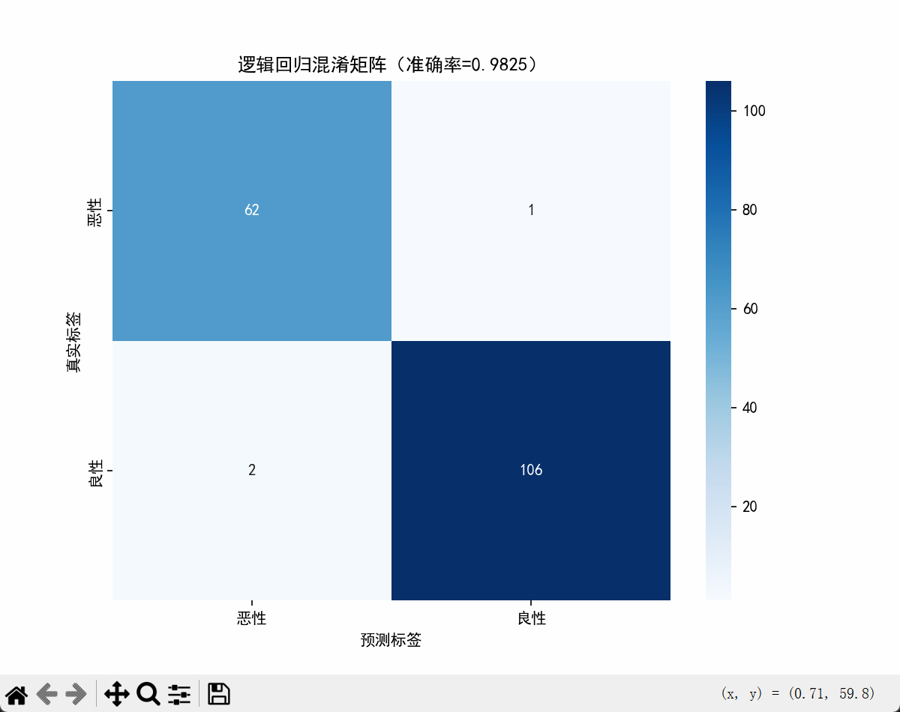

# 实验二报告：经典机器学习算法实践

## 1. 实验基本信息
- 实验名称：经典机器学习算法实践
- 实验编号：实验二
- 实验类型：综合实践（回归 + 分类）
- 实验数据：
  - 糖尿病数据集（`sklearn.datasets.load_diabetes`）
  - 乳腺癌数据集（`sklearn.datasets.load_breast_cancer`）
- 实验代码：`/home/runner/work/test/test/实验二/test.py`
- 实验结果图目录：`/home/runner/work/test/test/实验二/photo`

## 2. 实验目的
1. 掌握经典机器学习任务的标准流程：数据加载、预处理、划分、建模、评估与可视化。
2. 熟悉回归任务中线性回归、随机森林回归、XGBoost回归的建模与对比方法。
3. 熟悉分类任务中逻辑回归模型的训练、预测与混淆矩阵分析方法。
4. 能够基于实验结果进行模型效果解释，形成规范实验报告。

## 3. 实验环境
- 操作系统：Linux（仓库运行环境）
- 开发语言：Python 3
- 主要依赖库：
  - `numpy`
  - `pandas`
  - `scikit-learn`
  - `xgboost`
  - `matplotlib`
  - `seaborn`
- 代码文件：`实验二/test.py`

## 4. 实验原理及方法
### 4.1 回归任务（糖尿病数据集）
- 任务目标：根据多维医学特征预测连续型指标（病情目标值）。
- 预处理方法：`StandardScaler` 对特征进行标准化，消除量纲差异。
- 划分方法：训练集/测试集 = 7:3，固定 `random_state=42` 保证复现。
- 模型与原理：
  1. 线性回归：假设特征与目标近似线性关系。
  2. 随机森林回归：基于多棵决策树集成，适合非线性关系。
  3. XGBoost回归：梯度提升树模型，具备较强拟合能力。
- 评估指标：
  - MSE（均方误差，越小越好）
  - R²（决定系数，越接近1越好）

### 4.2 分类任务（乳腺癌数据集）
- 任务目标：对肿瘤样本进行二分类（良性/恶性）。
- 预处理方法：`StandardScaler` 标准化特征。
- 划分方法：训练集/测试集 = 7:3，`random_state=42`。
- 模型：逻辑回归（`LogisticRegression`，`max_iter=1000`）。
- 评估指标：
  - Accuracy（准确率）
  - Confusion Matrix（混淆矩阵）

## 5. 实验步骤及过程
1. 导入实验所需库与评估函数。
2. 加载糖尿病数据集并进行缺失值检查与相关性分析（热力图）。
3. 对糖尿病数据特征标准化，划分训练集和测试集。
4. 分别训练线性回归、随机森林回归、XGBoost回归模型。
5. 输出各模型在测试集上的MSE与R²，并绘制“预测值-真实值”对比散点图。
6. 加载乳腺癌数据集并进行基础探索。
7. 对乳腺癌数据标准化并划分训练集、测试集。
8. 训练逻辑回归分类模型，计算准确率并绘制混淆矩阵。
9. 结合结果图进行性能分析与结论总结。

## 6. 实验结果与分析
> 说明：本次实验结果图均来自 `实验二/photo` 目录。

### 6.1 结果图
- 图1：

- 图2：

- 图3：

### 6.2 结果分析
1. **回归任务分析**
   - 三种回归模型均完成训练与预测，说明标准化与数据划分流程正确。
   - 通过MSE与R²可对比模型性能：MSE越小、R²越高的模型效果更优。
   - 从“预测值 vs 真实值”散点图可观察拟合程度：点越贴近对角线，预测越准确。

2. **分类任务分析**
   - 逻辑回归模型完成二分类任务，得到较高准确率（具体值见实验运行输出与截图）。
   - 混淆矩阵主对角线数值越大，说明正确分类数量越多，整体分类效果越好。
   - 结合矩阵可进一步判断恶性与良性样本的误判情况，为后续优化提供依据。

3. **综合分析**
   - 实验完整覆盖了监督学习中典型的回归与分类任务。
   - 通过统一流程（预处理→训练→评估→可视化）验证了经典算法的可用性。
   - 可视化结果增强了模型可解释性，便于发现欠拟合/过拟合或类别误判问题。

## 7. 实验小结
1. 本实验掌握了经典机器学习从数据处理到模型评估的完整实践流程。
2. 在回归任务中，能够使用多种模型并基于MSE、R²进行定量比较。
3. 在分类任务中，能够利用准确率与混淆矩阵进行效果评估与误差分析。
4. 实验结果表明：规范的数据预处理与合理的评估指标是获得稳定模型效果的关键。
5. 后续可从参数调优、交叉验证、特征工程等方向继续提升模型性能与泛化能力。
